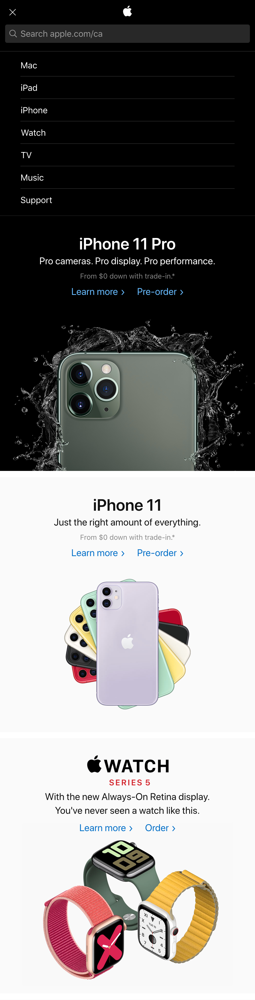
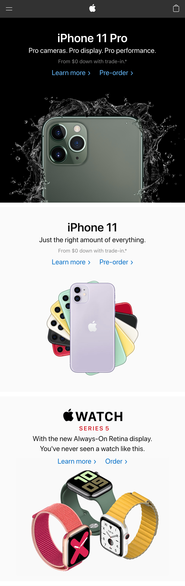

# Todo

## Next up...
- [x] Custom fonts (and font faces)
- [x] Inline vs block (`display`)
- [x] Units of measurement
  - `em` vs `rem`
- [ ] Link to sections
- [ ] Create menu, with list styling
- [ ] descendent selectors
- [ ] before/after

## Other upcoming tasks
- Form elements

# Goal

Build somethign like this:

| Menu Open     | Menu Closed   |
| ------------- | ------------- |
|  |  |